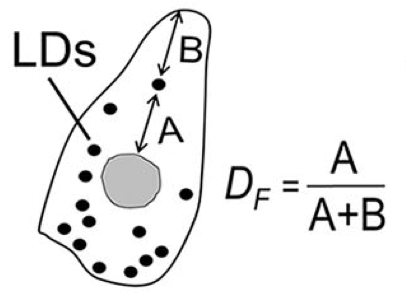

Organelle Level Features
========================

Common Features
---------------

These features are calculated for all organelles

* **label**: number index of each individual organelle

* **area**: the area of the organelle in :math:`{\mu}`\ m\ :sup:`2`

* **perimeter**: the perimeter of the organelle in :math:`{\mu}`\ m

* **centroid-0**: the y coordinate of the center of the organelle,
  measured from the top left corner of the image

* **centroid-1**: the x coordinate of the center of the organelle,
  measured from the top left corner of the image

* **axis major length**: the length of the major axis of the ellipse that has the same normalized
  second central moments as the organelle

* **axis minor length**: the length of the minor axis of the ellipse that has the same normalized
  second central moments as the organelle 

* **cell id**: the index of the cell that the organelle is located in
  cell id of 0 corresponds to the sinusoid 

* **aspect ratio**: ratio of the major axis to the minor axis

* **boundry distance**: distance from the centroid of the organelle to the nearest boundary of
  the cell **in pixels**

* **ascini_position**: relative position of the centroid of an organelle on the ascinus
  1 = portal vein and -1 = central vein

Mitochondria Specific Features
------------------------------
* ** solidity**: ratio of pixels in the organelle to the pixels in its convex hull

* **aspect type 1**: mitochondria with an aspect ratio < 1.2

* **aspect type 2**: mitochondria with an aspect ratio between 1.2 and 2

* **aspect type 3**: mitochondria with an aspect ratio > 2

Lipid Droplet Specific Features
-------------------------------

* **area type 1**: lipid droplets with an area less than 2.41 :math:`{\mu}`\ m\ :sup:`2`
  
* **area type 2**: lipid droplets with an area between 2.41 and 9.64 :math:`{\mu}`\ m\ :sup:`2`

* **area type 3**: lipid droplets with an area greater than 9.64 :math:`{\mu}`\ m\ :sup:`2`

Cell Level Features
===================

* **area**: the area of the cell in :math:`{\mu}`\ m\ :sup:`2`

* **centroid-0**: the y coordinate of the center of the cell,
  measured from the top left corner of the image

* **centroid-1**: the x coordinate of the center of the cell,
  measured from the top left corner of the iamge

* **label**: number index of the specific cell, used to match to the *cell id** feature
  of specific organelles

* **density**: the number of organelles per :math:`{\mu}`\ m\ :sup:`2`

* **average area**: mean area of all organelles of a specific type within a cell (:math:`{\mu}`\ m\ :sup:`2`

* **percent total area**: ratio of the total area occupied by organelles of
  a specific type to the total area of the cell

* **distance from edge**: ratio of the distance to the center of of the cell to
  the sum of the distance to the center of the cell and 
  the distance to the closest edge

* **aspect ratio**: mean aspect ratio of all organelles of a specific type within a cell

* **solidity**: mean solidity of all organelles of a specific type within a cell

* **percent type**: percent of all organelles within a cell that are a specific type,
  see *aspect type* for mitochondria and *area type* for lipid droplets

* **ascini position**: relative position of the centroid of the cell on the ascinus
  1 = portal vein, -1 = central vein

